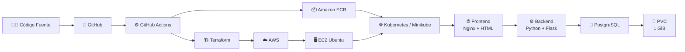
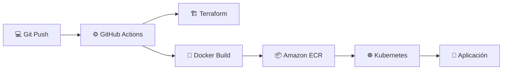

# 🚀 Hola Juan — DevOps & Cloud Lab

<p align="center">
  <b>Laboratorio End-to-End de DevOps, Cloud, IaC, CI/CD, Docker y Kubernetes sobre AWS</b>
</p>

<p align="center">
  ☁️ AWS &nbsp; • &nbsp;
  🏗️ Terraform &nbsp; • &nbsp;
  🐳 Docker &nbsp; • &nbsp;
  ☸️ Kubernetes &nbsp; • &nbsp;
  🔄 GitHub Actions &nbsp; • &nbsp;
  🐘 PostgreSQL
</p>

---

## 📌 Descripción del proyecto

**Hola Juan DevOps Lab** es un laboratorio práctico construido para implementar una aplicación web completa utilizando principios y herramientas de **DevOps y Cloud Computing**.

El proyecto integra infraestructura como código, contenedores, CI/CD, Kubernetes y persistencia de datos.

El objetivo principal es demostrar un flujo completo:

```text
Código
  ↓
GitHub
  ↓
GitHub Actions
  ↓
Terraform + Docker
  ↓
AWS + Amazon ECR
  ↓
Kubernetes
  ↓
Frontend → Backend → PostgreSQL
```

La aplicación muestra el mensaje:

> 👋 **Hola Juan**

y permite consultar información almacenada en PostgreSQL desde el navegador.

---

# 🏗️ Arquitectura de la solución



### Flujo de acceso a la aplicación

```text
                    INTERNET
                        │
                        ▼
                 ┌──────────────┐
                 │   AWS EC2    │
                 │    Ubuntu    │
                 └──────┬───────┘
                        │
                      :80
                        │
                        ▼
                 ┌──────────────┐
                 │ Nginx Host   │
                 └──────┬───────┘
                        │
                        ▼
                NodePort :30080
                        │
                        ▼
              ┌─────────────────┐
              │    FRONTEND     │
              │  Nginx + HTML   │
              └────────┬────────┘
                       │
                       │ /api
                       ▼
              ┌─────────────────┐
              │     BACKEND     │
              │ Python + Flask  │
              │     :5000       │
              └────────┬────────┘
                       │
                       ▼
              ┌─────────────────┐
              │   PostgreSQL    │
              │      :5432      │
              └────────┬────────┘
                       │
                       ▼
              ┌─────────────────┐
              │ postgres-pvc    │
              │      1 GiB      │
              └─────────────────┘
```

---

# 🧰 Stack tecnológico

| Área | Tecnología | Función |
|---|---|---|
| ☁️ Cloud | AWS | Plataforma de infraestructura |
| 🏗️ IaC | Terraform | Aprovisionamiento de infraestructura |
| 🐳 Contenedores | Docker | Construcción de imágenes |
| 📦 Registry | Amazon ECR | Almacenamiento de imágenes Docker |
| ☸️ Orquestación | Kubernetes | Gestión de contenedores |
| 🧪 Cluster | Minikube | Kubernetes ejecutado sobre EC2 |
| 🔄 CI/CD | GitHub Actions | Automatización del pipeline |
| 🔐 Autenticación | OIDC | Acceso GitHub → AWS sin Access Keys permanentes |
| 🌐 Frontend | Nginx + HTML | Interfaz web |
| ⚙️ Backend | Python + Flask | API REST |
| 🐘 Database | PostgreSQL | Persistencia de información |
| 💾 Storage | PVC | Persistencia del almacenamiento |
| 🐧 Sistema | Ubuntu | Sistema operativo de EC2 |
| 🛠️ Gestión | AWS Systems Manager | Ejecución remota utilizada por CI/CD |

---

# 📂 Estructura del proyecto

```text
hola-juan-devops/
│
├── .github/
│   └── workflows/
│       └── pipeline.yml
│
├── backend/
│   ├── app.py
│   ├── Dockerfile
│   └── requirements.txt
│
├── frontend/
│   ├── Dockerfile
│   ├── index.html
│   └── nginx.conf
│
├── kubernetes/
│   ├── namespace.yaml
│   ├── frontend.yaml
│   ├── backend.yaml
│   ├── postgres.yaml
│   └── ingress.yaml
│
├── terraform/
│   ├── providers.tf
│   ├── variables.tf
│   ├── terraform.tfvars
│   ├── network.tf
│   ├── security.tf
│   ├── ec2.tf
│   ├── ecr.tf
│   ├── iam-ec2.tf
│   ├── iam-github-ssm.tf
│   ├── outputs.tf
│   └── user-data.sh
│
├── bootstrap/
│   └── main.tf
│
├── .gitignore
└── README.md
```

---

# ☁️ Infraestructura AWS

La infraestructura del laboratorio se administra mediante **Terraform**, evitando crear manualmente los recursos principales.

## Recursos implementados

```text
AWS
│
├── VPC
│   └── 10.0.0.0/16
│
├── Public Subnet
│   └── 10.0.1.0/24
│
├── Internet Gateway
│
├── Route Table
│   └── 0.0.0.0/0 → Internet Gateway
│
├── Security Group
│   ├── TCP/22 → SSH
│   └── TCP/80 → HTTP
│
├── EC2
│   └── Ubuntu
│
├── IAM
│   ├── EC2 Role
│   ├── ECR permissions
│   └── Systems Manager
│
├── Amazon ECR
│   ├── frontend
│   └── backend
│
└── Amazon S3
    └── Terraform Remote State
```

Terraform permite que la infraestructura sea:

- ♻️ Reproducible
- 📋 Versionada
- 🤖 Automatizable
- 🔍 Auditable
- 🧱 Declarativa

---

# 🏗️ Terraform

El flujo básico utilizado es:

```bash
cd terraform

terraform init
terraform fmt
terraform validate
terraform plan
terraform apply
```

### Backend remoto

El estado de Terraform se almacena en Amazon S3.

```text
Terraform
    │
    ▼
Amazon S3
    │
    ▼
terraform.tfstate
```

Esto evita depender únicamente de un archivo de estado local.

---

# 🔐 GitHub Actions + AWS OIDC

GitHub Actions se autentica contra AWS mediante **OpenID Connect (OIDC)**.

```text
GitHub Actions
       │
       │ OIDC Token
       ▼
AWS IAM Role
       │
       ▼
Credenciales temporales
       │
       ▼
AWS
```

### Ventaja

No es necesario almacenar credenciales AWS permanentes como:

```text
AWS_ACCESS_KEY_ID
AWS_SECRET_ACCESS_KEY
```

Esto mejora la seguridad del pipeline.

---

# 🔄 Pipeline CI/CD

El pipeline automatiza el proceso desde GitHub hasta Kubernetes.



## Flujo

```text
1. Developer realiza git push
            │
            ▼
2. GitHub Actions inicia pipeline
            │
            ▼
3. Terraform valida/aplica infraestructura
            │
            ▼
4. Docker construye las imágenes
            │
            ▼
5. Imágenes se publican en Amazon ECR
            │
            ▼
6. GitHub Actions utiliza AWS SSM
            │
            ▼
7. Kubernetes actualiza los Deployments
            │
            ▼
8. Rollout de frontend/backend
            │
            ▼
9. Aplicación disponible
```

Las imágenes Docker se identifican mediante el **SHA del commit**, proporcionando trazabilidad entre código e imagen desplegada.

---

# 🐳 Docker

El proyecto contiene imágenes independientes para frontend y backend.

## Frontend

```text
HTML
  ↓
Nginx
  ↓
Docker Image
  ↓
Amazon ECR
```

## Backend

```text
Python
  ↓
Flask
  ↓
Docker Image
  ↓
Amazon ECR
```

Posteriormente Kubernetes utiliza estas imágenes para crear los pods.

---

# ☸️ Kubernetes

El cluster Kubernetes se ejecuta utilizando **Minikube sobre la instancia EC2**.

Namespace:

```text
hola-juan
```

Arquitectura interna:

```text
Namespace: hola-juan
│
├── Deployment
│      └── frontend
│
├── Deployment
│      └── backend
│
├── Deployment
│      └── postgres
│
├── Service
│      └── frontend
│           NodePort :30080
│
├── Service
│      └── backend
│           ClusterIP :5000
│
├── Service
│      └── postgres
│           ClusterIP :5432
│
└── PersistentVolumeClaim
       └── postgres-pvc
            1 GiB
```

---

# 🌐 Frontend

El frontend utiliza:

```text
HTML + Nginx
```

Su responsabilidad es:

- Mostrar la interfaz web.
- Mostrar el mensaje **Hola Juan**.
- Consumir la API del backend.
- Mostrar los registros almacenados en PostgreSQL.

Flujo:

```text
Usuario
   ↓
Nginx
   ↓
Frontend
   ↓
/api/personas
   ↓
Backend
```

---

# ⚙️ Backend REST API

El backend está desarrollado con:

```text
Python + Flask
```

Su función es comunicarse con PostgreSQL y exponer los datos mediante una API REST.

Flujo:

```text
Frontend
    │
    ▼
Flask API
    │
    ▼
PostgreSQL
```

Entre las operaciones implementadas se encuentran:

```text
GET  /api/personas
POST /api/personas
```

---

# 🐘 PostgreSQL

PostgreSQL almacena los registros utilizados por la aplicación.

Ejemplo:

```text
ID    Nombre        Profesión
--------------------------------
1     Juan          DevOps
2     PruebaPVC     DevOps
```

Consulta utilizada durante las pruebas:

```bash
kubectl exec -n hola-juan deployment/postgres -- \
psql -U juan -d holajuan \
-c "SELECT * FROM personas;"
```

---

# 💾 Persistencia con PVC

Inicialmente PostgreSQL utilizaba almacenamiento efímero.

El problema era:

```text
PostgreSQL Pod
      │
      X
 Pod eliminado
      │
      ▼
Posible pérdida de datos
```

Se implementó:

```text
PostgreSQL Pod
      │
      ▼
/var/lib/postgresql/data
      │
      ▼
postgres-pvc
      │
      ▼
PersistentVolume
```

Configuración:

| Propiedad | Valor |
|---|---|
| PVC | `postgres-pvc` |
| Capacidad | `1Gi` |
| Access Mode | `ReadWriteOnce` |
| StorageClass | `standard` |
| Estado comprobado | `Bound` |

### Evidencia obtenida

```text
postgres-pvc   Bound   1Gi   RWO   standard
```

---

# 🧪 Prueba real de persistencia

Se insertó:

```sql
INSERT INTO personas (nombre, profesion)
VALUES ('PruebaPVC', 'DevOps');
```

Después se eliminó el pod PostgreSQL.

```bash
kubectl delete pod -n hola-juan -l app=postgres
```

Kubernetes creó automáticamente otro pod.

Finalmente:

```sql
SELECT * FROM personas;
```

El registro:

```text
PruebaPVC | DevOps
```

continuó existiendo.

### Resultado

> 💾 **Persistencia comprobada correctamente.**

---

# 📈 Escalamiento Kubernetes

El frontend inicialmente tenía:

```text
1 réplica
```

Se ejecutó:

```bash
kubectl scale deployment frontend \
-n hola-juan \
--replicas=3
```

Resultado:

```text
Frontend Deployment
       │
       ├── Pod 1 ✅
       ├── Pod 2 ✅
       └── Pod 3 ✅
```

Los tres pods quedaron:

```text
1/1 Running
```

Después de la prueba se regresó a una réplica:

```bash
kubectl scale deployment frontend \
-n hola-juan \
--replicas=1
```

---

# ♻️ Self-Healing

También se comprobó la capacidad de recuperación automática de Kubernetes.

Se eliminó manualmente uno de los pods del frontend:

```bash
kubectl delete pod <frontend-pod> \
-n hola-juan
```

El Deployment detectó:

```text
Réplicas deseadas: 3
Réplicas disponibles: 2
```

El ReplicaSet creó automáticamente un nuevo pod.

```text
Pod eliminado ❌
      │
      ▼
Deployment detecta cambio
      │
      ▼
ReplicaSet crea nuevo Pod
      │
      ▼
3/3 Running ✅
```

### Resultado

> ♻️ **Self-healing de Kubernetes comprobado.**

---

# ⚡ Inicio automático de Minikube

Minikube fue configurado mediante **systemd** para iniciar automáticamente con la instancia EC2.

```text
EC2 inicia
    │
    ▼
Docker Service
    │
    ▼
minikube.service
    │
    ▼
Minikube
    │
    ▼
Kubernetes
```

Esto evita tener que iniciar manualmente Minikube después de reiniciar la EC2.

---

# 🧪 Pruebas realizadas

| Prueba | Resultado |
|---|:---:|
| Terraform deployment | ✅ PASS |
| Infraestructura AWS | ✅ PASS |
| GitHub Actions | ✅ PASS |
| OIDC GitHub → AWS | ✅ PASS |
| Docker Build | ✅ PASS |
| Push Amazon ECR | ✅ PASS |
| Deploy Kubernetes | ✅ PASS |
| Frontend | ✅ PASS |
| Backend REST API | ✅ PASS |
| PostgreSQL | ✅ PASS |
| PVC 1 GiB | ✅ PASS |
| PVC estado Bound | ✅ PASS |
| Persistencia después de eliminar PostgreSQL | ✅ PASS |
| Escalamiento 1 → 3 | ✅ PASS |
| Self-healing | ✅ PASS |
| Minikube auto-start | ✅ PASS |
| Aplicación desde navegador | ✅ PASS |

---

# 📊 Estado final

```text
┌─────────────────────────────────────────┐
│           HOLA JUAN DEVOPS LAB          │
├─────────────────────────────────────────┤
│                                         │
│  Frontend          1/1 Running     ✅   │
│  Backend           1/1 Running     ✅   │
│  PostgreSQL        1/1 Running     ✅   │
│  postgres-pvc      Bound           ✅   │
│  GitHub Actions    Success         ✅   │
│  Amazon ECR        Images          ✅   │
│  Terraform         AWS             ✅   │
│                                         │
└─────────────────────────────────────────┘
```

---

# 🖥️ Comandos útiles

### Ver pods

```bash
kubectl get pods -n hola-juan
```

### Ver servicios

```bash
kubectl get svc -n hola-juan
```

### Ver PVC

```bash
kubectl get pvc -n hola-juan
```

### Ver Persistent Volumes

```bash
kubectl get pv
```

### Ver deployments

```bash
kubectl get deployments -n hola-juan
```

### Logs backend

```bash
kubectl logs -n hola-juan deployment/backend
```

### Logs PostgreSQL

```bash
kubectl logs -n hola-juan deployment/postgres
```

### Consultar PostgreSQL

```bash
kubectl exec -n hola-juan deployment/postgres -- \
psql -U juan -d holajuan \
-c "SELECT * FROM personas;"
```

### Escalar frontend

```bash
kubectl scale deployment frontend \
-n hola-juan \
--replicas=3
```

### Ver rollout

```bash
kubectl rollout status deployment/frontend \
-n hola-juan
```

---

# 🔒 Seguridad aplicada

Durante el laboratorio se utilizaron diferentes controles:

```text
GitHub
   │
   │ OIDC
   ▼
IAM Role
   │
   ▼
AWS
```

Además:

- 🔐 Autenticación GitHub → AWS mediante OIDC.
- 🔑 SSH limitado a una IP autorizada.
- 🛡️ Security Groups.
- 🌐 VPC y subnet controladas mediante Terraform.
- 📦 EC2 con permisos de lectura de ECR.
- ⚙️ AWS Systems Manager para automatización del deployment.
- 🔒 Terraform State almacenado remotamente en S3.

---

# 🎓 ¿Qué demuestra este laboratorio?

Este proyecto demuestra conocimientos prácticos en:

```text
                 DEVOPS
                    │
       ┌────────────┼─────────────┐
       │            │             │
       ▼            ▼             ▼
      CLOUD        CI/CD      CONTAINERS
       │            │             │
       ▼            ▼             ▼
      AWS      GitHub Actions    Docker
       │                          │
       ▼                          ▼
   Terraform                  Kubernetes
                                  │
                                  ▼
                             PostgreSQL
```

Entre los conceptos practicados se encuentran:

- Infrastructure as Code.
- Automatización CI/CD.
- Dockerización de aplicaciones.
- Registro de imágenes.
- Kubernetes Deployments.
- Services.
- Persistent Volumes.
- PersistentVolumeClaims.
- Escalamiento.
- Self-healing.
- IAM.
- OIDC.
- AWS Systems Manager.
- Git y GitHub.
- Troubleshooting de infraestructura y Kubernetes.

---

# ⚠️ Consideraciones del laboratorio

Este proyecto es un **entorno educativo**, no una arquitectura productiva.

Minikube se ejecuta dentro de una sola instancia EC2:

```text
EC2
 └── Minikube
       └── Kubernetes
```

Por esta razón, aunque Kubernetes puede recuperar pods, existe un único nodo físico/virtual para el cluster.

El PVC utiliza:

```text
minikube-hostpath
```

Por lo tanto, protege los datos frente a la recreación de un **pod**, pero no representa una solución de alta disponibilidad frente a la pérdida completa de la instancia EC2 o del cluster Minikube.

En un entorno productivo podrían utilizarse:

```text
Amazon EKS
Amazon EBS CSI Driver
Amazon RDS
AWS Secrets Manager
Application Load Balancer
CloudWatch
Prometheus
Grafana
```

---

# 🧹 Limpieza del laboratorio

Cuando el laboratorio ya no sea necesario, los recursos AWS deben eliminarse para evitar costos.

Antes:

```bash
terraform plan -destroy
```

Después, únicamente cuando se haya confirmado que todo puede eliminarse:

```bash
terraform destroy
```

> ⚠️ **No ejecutar `terraform destroy` mientras se necesite conservar el laboratorio.**

---

# 🏆 Resultado

El laboratorio consiguió integrar exitosamente:

```text
                    ☁️ AWS
                      │
              🏗️ Terraform
                      │
                 🖥️ EC2
                      │
                 ☸️ Minikube
                      │
                Kubernetes
             ┌────────┼────────┐
             │        │        │
             ▼        ▼        ▼
         Frontend  Backend  PostgreSQL
                              │
                              ▼
                          💾 PVC 1GiB

GitHub ──► GitHub Actions ──► Docker ──► ECR ──► Kubernetes
```

### ✅ Infraestructura automatizada  
### ✅ CI/CD funcionando  
### ✅ Contenedores versionados  
### ✅ Kubernetes funcionando  
### ✅ Base de datos persistente  
### ✅ Escalamiento comprobado  
### ✅ Self-healing comprobado  
### ✅ Aplicación accesible desde Internet  

---

# 👨‍💻 Autor

**Juan Sebastián Ferrer Bustos**

Ingeniero Electrónico | Especialista en Seguridad Informática

**DevOps • Cloud • AWS • Terraform • Docker • Kubernetes • Seguridad**

---

<p align="center">
  <b>🚀 Build • Automate • Deploy • Learn • Repeat</b>
</p>

<p align="center">
  <i>Pequeños laboratorios, grandes oportunidades.</i>
</p>